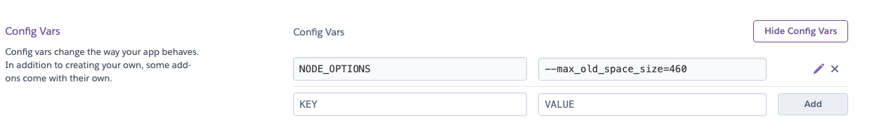

# Choose-a-Share app

To chose the best divider shares.

Deployed url: https://choose-a-share.cloudsteak.com


The app is capable to parse then filter the weekly updated Dividend Radar excel spreadsheet (https://www.portfolio-insight.com/dividend-radar).


For further question, please ping me: https://cloudsteak.com

```
NODE_OPTIONS : --max_old_space_size=460
```




## Update

```bash
git add .

git commit -am "Version: 20220718"

git push heroku main 
```